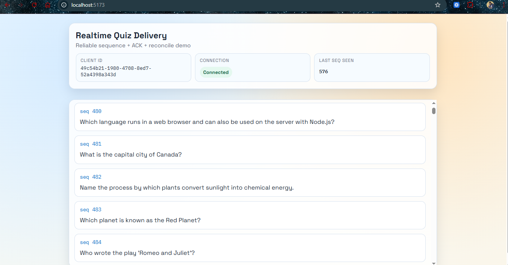

# Reliable Real-Time Question Delivery System

A small real time quiz delivery system that guarantees every connected client receives every question, even if the connection briefly drops.

The system uses sequence numbers, per client acknowledgements, and a reconciliation endpoint to recover missed messages.



---

# Architecture Overview

Server responsibilities

- Assign monotonically increasing sequence numbers to questions
- Store questions in an append only log
- Track per client acknowledgement state
- Deliver questions over WebSockets
- Provide a reconcile endpoint for reconnecting clients

Client responsibilities

- Maintain a persistent clientId
- Receive questions over Socket.IO
- Detect sequence gaps
- Acknowledge each question
- Recover missed questions via REST on reconnect

---

# Project Structure

```text
quiz-delivery-task
|
|-- server
|   |-- package.json
|   |-- tsconfig.json
|   `-- src
|       |-- index.ts
|       |-- config.ts
|       |-- routes
|       |   |-- reconcile.ts
|       |   |-- health.ts
|       |   `-- questions.ts
|       |-- realtime
|       |   `-- socket.ts
|       |-- quiz
|       |   |-- session.ts
|       |   |-- ackStore.ts
|       |   |-- questionBank.ts
|       |   `-- types.ts
|       `-- utils
|           |-- validate.ts
|           `-- logger.ts
|
|-- client
|   |-- package.json
|   |-- tsconfig.json
|   |-- vite.config.ts
|   `-- src
|       |-- index.html
|       |-- styles.css
|       |-- main.ts
|       |-- api.ts
|       |-- storage.ts
|       `-- types.ts
|
`-- README.md
```

---

# Key Concepts

Sequence numbers
Every question receives a strictly increasing `seq`.

Acknowledgements
Clients emit an acknowledgement for every received question.

Gap detection
If a client receives `seq 4` after `seq 2`, a warning is logged.

Reconciliation
Clients that reconnect request missed questions from:

```http
GET /reconcile?clientId=XXX&lastSeq=N
```

The server returns all questions with `seq > N` that have not been acknowledged.

---

# Quick Start

Prerequisites

Node 18 or newer

---

### Start server

```bash
cd server
npm install
npm run dev
```

Server runs on

```text
http://localhost:3001
```

---

### Start client

Open a second terminal

```bash
cd client
npm install
npm run dev
```

Open the provided local URL in your browser (`http://localhost:5173`).

---

# Architecture Overview section.

## System Architecture

```id="archflow1"
                +----------------------+
                |        Server        |
                |----------------------|
                |  Question Log        |
                |  Seq Generator       |
                |  ACK Store           |
                |----------------------|
                |  Socket.IO Delivery  |
                |  /reconcile Endpoint |
                +----------+-----------+
                           |
                    WebSocket / HTTP
                           |
        -----------------------------------------
        |                                       |
+------------------+                 +------------------+
|      Client A     |                 |      Client B     |
|------------------|                 |------------------|
| lastSeqSeen      |                 | lastSeqSeen      |
| Gap Detection    |                 | Gap Detection    |
| ACK Sender       |                 | ACK Sender       |
| Reconcile Logic  |                 | Reconcile Logic  |
+------------------+                 +------------------+
```

---

## Message Flow

```id="flow1"
1 Server generates question (seq++)
2 Question stored in server log
3 Server broadcasts question
4 Client receives question
5 Client sends ACK
6 Server records ACK
7 If client reconnects -> /reconcile -> missed questions returned
```

---

## Reliability Model

```id="flow2"
Delivery: At least once
Ordering: Guaranteed by sequence numbers
Recovery: Client driven reconciliation
Duplicate safety: Client ignores already seen seq
```

---

## Why this design works

- No question is lost
- Reconnects are safe
- Clients detect gaps immediately
- Server remains simple and deterministic

This is the same pattern used by many real time systems.

---

# Testing the System

### Multi client simulation

Open two browser tabs.
Each tab acts as an independent client with its own acknowledgement state.

### Gap detection

Temporarily disable network or close a tab while questions are being sent.
When reconnecting the client will:

1. Call the reconcile endpoint
2. Receive missed questions
3. Continue from the correct sequence

Console will log gap warnings.

---

# Example Question Flow

```text
Server emits question seq 1
Client receives
Client ACK seq 1

Server emits seq 2
Connection drops

Server emits seq 3

Client reconnects
Client calls /reconcile
Server returns seq 2 and seq 3
Client catches up
```

---

# Optional Enhancements Included

- LaTeX question rendering (KaTeX CDN with plain text fallback)
- Two client simulation
- Health endpoint for quick verification
- Manual question injection endpoint (`POST /questions`)

---

# Design Notes

The system uses an append only question log and per client acknowledgement tracking to ensure reliable delivery.

Delivery is at least once, with the client responsible for deduplication using sequence numbers.

This mirrors patterns used in production messaging systems.

---

# Run Time Under 5 Minutes

Install dependencies and run two commands.
No database or external services required.

---

# Code-Accurate Implementation Details

- Auto dispatch starts about 1.2 seconds after server start, then runs every 5500 ms.
- Sample bank contains 8 questions, including one question with a LaTeX expression.
- Reconcile calculation is `sinceSeq = max(lastSeq, ackStore.getAck(clientId))` and returns `quizSession.getAfter(sinceSeq)`.
- ACK store keeps highest acknowledged seq per client (`Map<clientId, highestAckSeq>`).
- Client emits `client:ack` for both realtime and recovered questions.
- Gap warning string is:
  `WARNING: Gap detected - expected seq X, received seq Y`
- Recovered questions are rendered in ascending sequence order and tagged `Recovered` briefly.
- Client identity is stable per browser tab session and persisted in localStorage using a tab-scoped key.
- Server startup now handles `EADDRINUSE` with a clear warning and exits cleanly.

---
